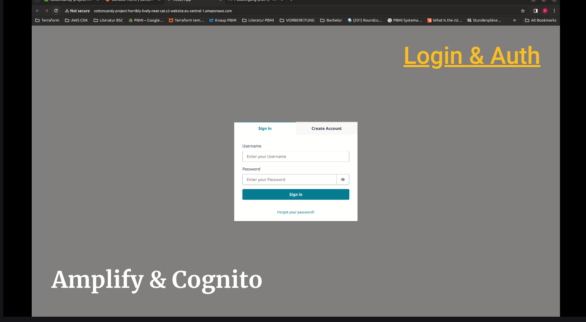

## Peter Haidt , Jana Farag, MIM1
### Repo: cottoncandy

## Introduction 

If you have a sweet tooth, then you have come to the right place:

Cotton Candy 4 All is an online shopping static webapplication for ordering cotton candy in all varieties, shapes and flavors.

With our integrated Cognito authentication service we ensure secured credetials and specialized user accounts.

Upon authorization our application can be accessed to order cotton candy. All products can be viewed on the landing page and chosen to be added to the cart.

All selected items are added to the cart and can be seen and edited there in an overview. The total price can be checked before purchase.

For checkout the details of the user are obtained through a form to aquire the shipping address and preferred email for confirmation.

After a successful checkout the order is saved in our database so it can be produced and a confirmation email is sent the user confirming the purchased items and price fucntioning as an invoice.
While waiting for the order the user may choose to peek behind the curtains and is redirected to a live feed of the order being produced.

If you have any questions regarding your order or our products, you can contact us anytime with all  credetials listed on the contact page.

Have a sweet day,
Your Cotton Candy 4 All Team

## Video

## Architecture

Architecture Diagram:

### Frontend S3 Bucket

The built webapplication (after npm run build) is hosted as a static website. The frontend contents are (.js files, .css..) are saved and hosted as s3 objects as static content.

If user tries to access the website, he/she is directly redirected to authentication. If a user is not authenticated, the access to the website is not granted. The authentication uses AWS Amplify UI which directly communicates with AWS Cognito.
AWS Cognito data (user pool id, user pool web client, user identity pool id) needs to be inputed into the frontend's AWS Amplify UI, so that it is configured correctly. Therefore the frontend dynamically reads a scripted configuration file generated by terraform at compile time to ensure the AWS configuations are up to date for every resource modification.
Amplify UI is used here as it already provides pre-built UI components for common authentication flows and can be integrated with AWS Conginto with ease.
The flows enabled by its use are "Sign Up", "Sign in", "Forgot Password" including the flows for sending verification emails and codes. 
THe configuration of the use pool e.g. with password requirements however, was set up through Terraform.

The user can interact with the frontend of the application to add the items to the cart, review them and then checkout to place an order. With the checkout a post request is sent to the API Gateway that triggers the corresponding lambda function. 
Note: The API gateway link is retrieved dynamically from the configuartion file so that it is correct.
The parameters sent for further processing consist of the order data, and customer details.

Upon successfully checking out the user lands on the checkout site. There a link is provided for further inspection of the production process. The click on this link redirects the user to a youtube video. This is achieved by sending a post request to the API gateway with the endpoint for triggering the redirect_lambda function.

### API Gateway

The API gateway exposes two endpoint to the frontend:
1) /order : a post request will trigger the order_lambda fucntion
2) /jolly : a post request will trigger the redirect_lambda

To enable monitoring, Cloudwatch logs are configured and logged for all API Gateway calls.
The API gateway CORS configuration was set to allow all origins so that the functionalities are publicy accessible through the website.

### redirect_lambda

This lambda function contains the logic to redirect the user to a chosen youtube video.

### order_lambda

This lambda function receives the order data (products and total price) and the details of the customer (email and shipping address). Upon receival the lambda sends the data to an sqs message queue for the order to be processed asynchronously.

The choice for a message queue is good practice while saving big amount of data (buffer). This ensured that the application is scalable and can handle multiple orders in parallel regardless of the capacity of the database to receive and save data.
This also allows more cohesive and loosely coupled components. Added to that, if needed , business data can be flexibly added to the frontend data.

### SQS

AWS Simple Queueing Service (SQS) is used as a buffer for saving data in the database asyncronously.

### persistence_lambda

This lambda function contains the logic to read data from the message queue and persist it in the database in batches.

The SQS order queue and the persistence_lambda are connected thorugh an event source mapping. This allows for execution only upon receival of data instead of polling continously for new data from the message queue.

This choice of architecture also allows the receival of messages with a chosen batch size as an input to then insert in the database.

### order_table

The order table is created and maintained for all placed orders and customer details.
This data also serves as a source for the invoice and confirmation message for a successful order submission.

### dynamoDB_stream

To make sure that the user only receives the invoice and confirmation when the data is successfully saved, dynamoDB streams are used.

As soon as the order_table changes the dynamoDB stream captures these changes and those are used as a trigger for the send_orderemail lambda function.

An event source mapping again triggers the following lambda fucntion.

### send_order_email_lambda

This lambda function contains the logic to send a confirmation mail to the email provided by the user. To complete this action this component uses the AWS simple mail service.

### Simple Email Service

This AWS service is reposible for sending the email to the customer.
(Note: SMS runs in a sandbox environment and the receiving and sending emails need to be specified and confirmed. This isn't the case for actual production environments)

## Tooling

### Development

### Terraform

Terraform was used as an Infrastructure as Code (IaC) tool that enables the definition and provisioning of infrastructure in a declarative manner. Terraform enables the can creation, update, and destruction of resources consistently across environments.

Terraform can allow to remotely and centrally manage the state of infratructure and resources and only update chnaged files.

In this project it is used to create resources, ids, manage their names and insert them where needed. For the frontent to acces these variables it also outputs a scripted config.js file with all needed variables.
With the "depends on" keyword it can be configured for certain resources to only be created after others.

### Reactjs

React allows the creation of reusable components and the use of already existing components. It was used to efficiently manage the UI state, style it and add its functionality. The built state of the UI is then uploaded as s3 objects and hosted on s3 buckets as a static website.

The dynamic "window" navigation at runtime (config.js) for fetching the configuration file variables allow dynamically configured and adapted variables even in a static and deployed state.

For developers: If the variable values are needed that were not yet created with terraform (and will only be created at compile time) can be added to the script that is outputted by terraform (output.tf) so that it is written into the public folder of the frontend and read there at runtime. 

### Deployment

The deployment is completely automated. After aplying changes locally and then pushing to the GitLab remote branch the pipeline is automatically triggered.
The pipeline includes 4 stages:
1) validate: code is checked for syntax errors, formatting, and other issues. Terraform configurations are validated, ensuring correctness.
2) plan: Terraform generates an execution plan that shows what changes will be applied to your infrastructure. It helps prevent unexpected modifications.
3) apply: once the plan is reviewed and approved, Terraform applies the changes to the AWS resources, where needed. New resources are created, and existing ones are updated.
Note: This stage was configured to be run manually by the developer (which can be changed)
4) destroy: when needed, the “destroy” stage removes resources. This is useful for cleaning up after testing or decommissioning.
Note: This stage was configured to be run manually by the developer 

## Lessons Learned

1) Built frontend files and styling files can be uploaded as s3 object in s3 bucket storage if they are declared as template files prior to that. As this is a website the (unrecommended) settings of making the s3 bucket completely publicly accessible is needed despite the warnings not to do it. Using a CDN would make sense at this point.

Using withAuthenticator() on the App at least puts a layer over the browser execution.

Our first static website:

2) Roles and policies are needed for everything. Therefore first of all a good overview of these roles and policies and atatchments are important when mainatining files as a developer, because you can quickly lose oversight. It was unusual at first to have to allow configured AWS services to have access to other services, e.g. allow the lamda fucntion to be executed from the API gateway. But on the other hand this allows fine grained control over every resource, service, role and permission.

3) By using Cloud Services a lot of "ready to go" components can be configured quickly and added without the overhead, e.g. having to configure Login flows or to encrypt data before storing it in a databse... Especially for the security and ecryption aspect of user data in DynamDB or in s3 buckets can be a responsibility directed onto the cloud service provider (AWS in this case).

4) We learned how to use services as triggers for other services (lambda as a trigger for sqs, sqs as a trigger for lambda, dynamoDB streams as a trigger for lambda and api gateway endpoint as a tigger for lambda)
 We also learned how event source mapping can facilitate this process and make it more efficient.

5) We learned that testing the fucntionality is hard, testing two combined isolated services is hard. testing a chain requires the combination of several tests (puzzle pieces) to be able to glue together where the problem exactly is. Not having a debugger of some sort, to be able to view variables and their states was a bit challenging.
For high level testing the Web Console for AWS presented itself as the most suitable option.

6) The second bigger challenge was configuring the pipeline. While the pipeline was not working correctly, all resources had to be deleted manually in order to be able to create them again (naming conflicts and unmanaged state). And when there is no functioning destroy stage yet, the destruction cannot be automated. In a future project we would first test the pipeline with fewer resources and write a script (e.g. with CloudShell) to automate the destruction of all resources if needed.
To make the pipeline configuration work an important step was to make the stages dependent on the .tf state file as it holds all the changes that need to be made.

7) When hosting a static website it turned out to be hard to include dynamically created data and resource names form Terraform. Eventually this could be solved by instructing Terraform to write its outputs into a configuration (config.js) file into the public folder of the forntend. The public folder could be accessed at runtime and therefore even in the built stage the frontend could send requests to the correct endpoints. (add "" to index.html in your public folder and add your config.js aswell)--> these will be included to the build folder after (npm run build) and make the dynamic url changes possible in the "static" files. Doing this with .env variables requires rebuilding the project each time using npm.

8) The "pay-as you go" for cloud services is very resourceful. It allows the freedom for flexibility, exlporation, optimization and budgeting. We could leave the entire application or functions running with all the logic, in case someone wants to use it. But then only pay when a specific resource is actually requested or a function is triggered. This allows companies to save in the right times and invest in exactly the right time in resources.

On the same note, our s3 bucket content is quite large and by automating the content uploads with terraform the free tier limit was exeeded through repeated applies and destroys and subsequent RW to s3.

9) Terraform execution plans are very helpful. Before applying changes, you can review the plan to understand what resources mwill be created, modified, or destroyed.
This helped us prevent accidental or unexpected changes.

10) Terraform allows the developers to focus on development rather than what resources need to be deleted or adapted for a certain change in logic to work. It let's the devloper focus on what they want rather than how to achieve it.

